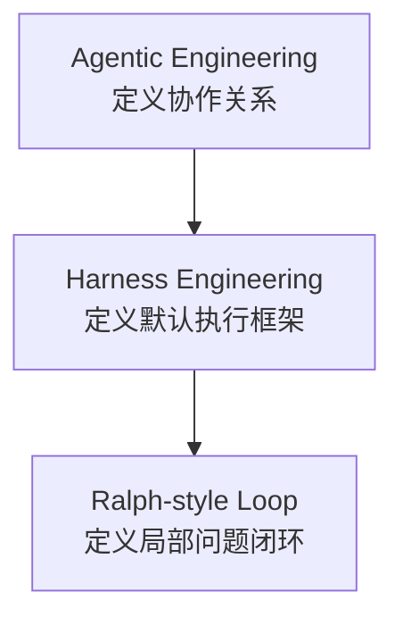
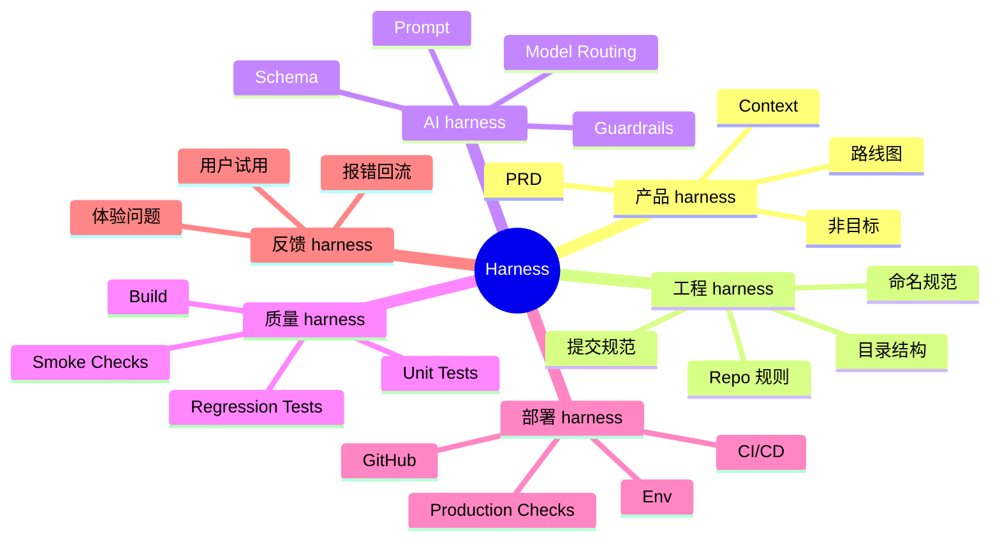
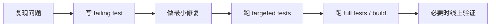
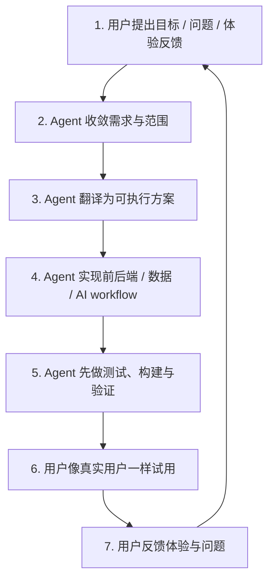

# Harness-First Agentic Development

<div align="center">


**一套适合非技术产品 Owner 与 AI 编码 Agent 协作的正式开发方法**

让用户负责目标与体验，  
让 Agent 负责方案、实现、测试、部署与修复。

</div>

---

## 这是什么

`Harness-First Agentic Development` 是一套混合式开发方法，用来解决一个很现实的问题：

> 当产品 Owner 不想亲自写代码，也不想承担架构设计责任，但又希望 AI agent 真正负责把产品做出来，应该如何组织开发流程？

这套方法的核心不是“让 AI 自己乱做”，而是把三层概念拆开：

- `Agentic Engineering`：定义人和 agent 如何分工
- `Harness Engineering`：定义开发、测试、部署、反馈的主流程
- `Ralph-style loop`：定义 bugfix 和小范围重构如何快速闭环

## 一句话定义

> 由人类负责目标、优先级和体验验收，由 agent 负责端到端工程执行，并通过文档、约束、测试、部署和反馈回流来控制质量。

## 为什么需要这套方法

很多所谓的“AI 开发流程”要么太空泛，要么太依赖技术背景：

- 有些方法默认用户自己会写详细技术规格
- 有些方法把 agent 当高级 autocomplete
- 有些方法没有验证闭环，代码能跑就算完成
- 有些方法没有角色边界，导致需求、设计和实现混在一起

这套方法解决的是：

1. **需求通常不清楚**
2. **产品 Owner 不懂代码**
3. **Agent 必须承担执行**
4. **交付前必须先验证**
5. **最终要以真实用户体验做验收**

## 方法结构



### 1. Agentic Engineering

回答两个问题：

- 谁负责什么？
- 人和 agent 如何协作？

推荐分工：

- **人类 Product Owner**
  - 提目标
  - 定优先级
  - 做体验判断
  - 做最终验收

- **Agent 工程负责人**
  - 收敛需求
  - 写文档
  - 设计方案
  - 写代码
  - 跑测试
  - 处理部署
  - 修复问题

### 2. Harness Engineering

这是主方法。

不是让 agent “尽量聪明”，而是给它一个稳定的工作环境。



### 3. Ralph-style Loop

这是局部闭环机制，不是全局开发方法。

适用：

- 明确 bug
- 小范围 refactor
- schema / prompt 兼容问题
- 文档和代码不一致的修补

标准步骤：



## 默认开发闭环



## 适合谁

这套方法特别适合：

- 不想亲自写代码的产品经理
- 想让 AI 真正负责开发的独立开发者
- 作为“产品 Owner + 种子用户”的 founder
- 想把 AI 协作流程制度化的小团队

## 不适合谁

它不太适合：

- 需要多人同步编码的大型传统企业项目
- 没有明确产品 Owner 的组织
- 完全不接受 agent 自主执行的团队
- 只想把 AI 当代码补全工具的人

## 仓库结构

```text
.
├── README.md
├── LICENSE
├── docs/
│   ├── harness-first-agentic-development-method.md
│   └── how-to-use-this-method-with-ai.md
└── templates/
    ├── AI_PROJECT_KICKOFF_PROMPT_TEMPLATE.md
    ├── PRODUCT_CONTEXT_TEMPLATE.md
    ├── PROJECT_JOURNEY_TEMPLATE.md
    └── SESSION_HANDOFF_PROMPT_TEMPLATE.md
```

## 如何使用

### 最小使用方式

1. 复制这套方法论文档
2. 复制 `templates/` 下的 3 个模板
3. 在你的项目里定义：
   - 产品主路径
   - Product Owner 角色
   - Agent 角色
   - 验收方式
4. 开始按这套闭环推进开发

### 推荐顺序

1. 先写 `Product Context`
2. 再写 `Project Journey`
3. 再写 `Session Handoff Prompt`
4. 然后开始具体产品开发

### 如果你是把这套方法交给 AI 使用

最直接的入口是：

1. 看使用指南
   [How to Use This Method With AI](./docs/how-to-use-this-method-with-ai.md)
2. 复制启动 prompt 模板
   [AI Project Kickoff Prompt Template](./templates/AI_PROJECT_KICKOFF_PROMPT_TEMPLATE.md)
3. 再把你的项目路径、仓库地址和 3 个上下文文件路径替换进去发给 AI

## 设计原则

- **人类定义目标，agent 承担执行**
- **先收敛需求，再写代码**
- **先验证，再交付**
- **用户体验反馈高于工程自嗨**
- **用 harness 管理 agent，不靠运气**

## 你可以怎么扩展这个仓库

后续很适合继续新增：

- `frontend-guidelines.md`
- `ai-workflow-guidelines.md`
- `evaluation-playbook.md`
- `deployment-checklist.md`
- `bugfix-loop-template.md`

也就是说，这个仓库本身可以继续长成一个完整的 **AI 产品开发操作系统**。

## 文档入口

- [正式方法论文档](./docs/harness-first-agentic-development-method.md)
- [AI 使用指南](./docs/how-to-use-this-method-with-ai.md)
- [AI 启动 Prompt 模板](./templates/AI_PROJECT_KICKOFF_PROMPT_TEMPLATE.md)
- [Product Context 模板](./templates/PRODUCT_CONTEXT_TEMPLATE.md)
- [Project Journey 模板](./templates/PROJECT_JOURNEY_TEMPLATE.md)
- [Session Handoff Prompt 模板](./templates/SESSION_HANDOFF_PROMPT_TEMPLATE.md)

## 开源协议

本仓库使用 [MIT License](./LICENSE)。

---

<div align="center">

**Build with goals. Control with harnesses. Ship with feedback.**

</div>
