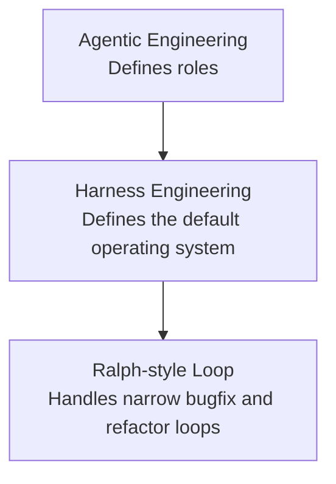

# Harness-First Agentic Development

[English](./README.md) | [简体中文](./README.zh-CN.md)

An **AI product development framework** for **agentic engineering**, **AI coding workflows**, and **human-in-the-loop software delivery**.

It is designed for teams where:

- humans define goals, priorities, and acceptance,
- AI agents own requirement convergence, implementation, testing, deployment, and repair.

---

## Quick Intro

Most AI dev workflows fail for one of three reasons:

1. the product owner is forced to become a part-time engineer,
2. the AI agent is given too much freedom and too few constraints,
3. no one defines a clear loop from requirement to verification to user feedback.

This repository solves that with one simple model:

> Humans steer. Agents execute. Harnesses control quality.

---

## Quickstart

You should be able to use this method with almost no setup.

### Minimum input

Just give your AI:

1. this repository link
   `https://github.com/JNHFlow21/harness-first-agentic-development`

2. your project repository link or local project path

3. a one-sentence product goal
   Example:
   `Build an AI workspace for Chinese users preparing product manager interviews.`

### Copy this into your AI

```text
Use this repository as the development method for our project:
https://github.com/JNHFlow21/harness-first-agentic-development

My project repo / path:
[YOUR_PROJECT_REPO_OR_PATH]

My product goal:
[ONE_SENTENCE_PRODUCT_GOAL]

Instructions:
1. Read this method repository first.
2. Use it as the operating standard for this project.
3. If my project does not already have context docs, initialize them yourself.
4. Converge requirements before implementation.
5. Own implementation, testing, deployment, and repair.
6. Verify your work before handing it back to me.
7. I only own goals, priorities, and experience acceptance.
```

### What the AI should do automatically

If the AI is following this method correctly, it should:

1. read this repository first,
2. inspect your project repo,
3. create missing context documents if needed,
4. clarify the main path, MVP, and non-goals,
5. implement the required work,
6. test and verify before handoff,
7. give you something you can try as a real user.

In other words, **the human should not need to manually copy templates before work starts**.

---

## The Method in One View

This is a layered system:



### Agentic Engineering

Defines responsibility:

- Human: goals, priorities, acceptance
- AI: convergence, implementation, testing, deployment, repair

### Harness Engineering

Defines the main operating system:

- product harness,
- engineering harness,
- AI harness,
- quality harness,
- deployment harness,
- feedback harness.

### Ralph-style Loop

Used only for narrow, well-defined issues:

- reproducible bugs,
- small refactors,
- schema or prompt compatibility problems.

---

## Repository Contents

```text
.
├── README.md
├── README.zh-CN.md
├── LICENSE
├── docs/
│   └── harness-first-agentic-development-method.md
└── templates/
    ├── AI_PROJECT_KICKOFF_PROMPT_TEMPLATE.md
    ├── PRODUCT_CONTEXT_TEMPLATE.md
    ├── PROJECT_JOURNEY_TEMPLATE.md
    └── SESSION_HANDOFF_PROMPT_TEMPLATE.md
```

## Start Here

- [Formal method document](./docs/harness-first-agentic-development-method.md)
- [Kickoff prompt template](./templates/AI_PROJECT_KICKOFF_PROMPT_TEMPLATE.md)

The templates remain in the repo as **optional reference material**.
They are for AI initialization or advanced customization, not the default first step for the human user.

---

## Who This Is For

- product managers who do not want to be forced into low-level engineering,
- founders building with AI coding agents,
- solo builders,
- small teams standardizing AI-native product development.

---

## Core Principles

- Humans define goals. AI owns execution.
- Converge requirements before implementation.
- Verify before handoff.
- User feedback outranks engineering vanity.
- Automate initialization whenever possible.

---

## License

This repository is licensed under the [MIT License](./LICENSE).
