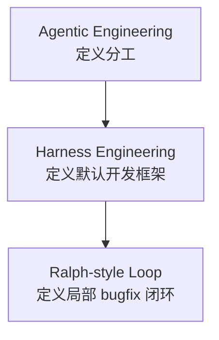

# Harness-First Agentic Development

<div align="center">


**让人类负责目标与验收，让 AI 负责开发、测试、部署与修复。**

</div>

---

## 介绍

这是一个给 AI 使用的开发规范仓库。

目标很简单：

- 你不需要自己写详细技术文档
- 你不需要自己复制一堆模板
- 你也不需要自己先懂架构

你只需要把这个仓库链接发给 AI，再告诉它：

> 按这个仓库作为我们的开发规范，来推进本次项目开发。

然后 AI 应该自己去做这些事：

1. 读取本仓库内容
2. 在你的项目里初始化需要的上下文文档
3. 先收敛需求，再开始实现
4. 自己负责测试、构建、部署和修复
5. 最后把可试用版本交给你验收

---

## Quickstart

### 你最少只需要提供 3 样东西

1. 这个规范仓库链接
   `https://github.com/JNHFlow21/harness-first-agentic-development`

2. 你的项目仓库链接或项目目录路径

3. 你的一句话项目目标
   例如：
   `做一个帮助中文用户准备 AI 产品经理面试的 AI 工作台`

### 直接发给 AI 的最简 Prompt

把下面这段直接发给 AI，用你自己的项目信息替换即可：

```text
请把这个仓库作为我们本次项目开发的规范指南：
https://github.com/JNHFlow21/harness-first-agentic-development

我的项目仓库 / 目录：
[YOUR_PROJECT_REPO_OR_PATH]

我的项目目标：
[ONE_SENTENCE_PRODUCT_GOAL]

要求：
1. 先读取这个规范仓库的 README 和 docs
2. 按照这套方法来负责本次项目开发
3. 如果我的项目里还没有上下文文档，你自己初始化并维护
4. 先收敛需求，再实现
5. 你负责后续的代码、测试、部署和修复
6. 在交给我之前，先自己验证
7. 我只负责需求、优先级和体验验收
```

### AI 收到后应该自动做什么

如果 AI 正确使用这套方法，它应该自动完成：

1. 读取本仓库的 README、方法论文档和使用指南
2. 检查你的项目里是否已有 `Product Context`、`Project Journey`、`Session Handoff Prompt`
3. 如果没有，就自己创建
4. 根据你的项目目标先收敛主路径、MVP 和非目标
5. 再进入实现
6. 交付前先测试、build、smoke check
7. 最后再交给你试用

---

## 这套方法是什么

它不是单一概念，而是三层组合：



### Agentic

定义角色：

- 人类负责目标、优先级、体验判断和验收
- AI 负责方案、实现、测试、部署和修复

### Harness

定义主流程：

- 文档
- 约束
- schema / prompt
- 测试
- 部署
- 反馈回流

### Ralph-style Loop

只用于：

- 明确 bug 修复
- 小范围重构
- schema / prompt 兼容问题

---

## 详细文档

- [正式方法论文档](./docs/harness-first-agentic-development-method.md)
- [AI 使用指南](./docs/how-to-use-this-method-with-ai.md)
- [AI 启动 Prompt 模板](./templates/AI_PROJECT_KICKOFF_PROMPT_TEMPLATE.md)

---

## 模板文件

这个仓库仍然保留模板，但它们是：

- 给 AI 自动初始化项目时使用的参考材料
- 给想做更细定制的人使用的高级入口

默认情况下，**人不需要先手动复制这些模板**。

- [Product Context 模板](./templates/PRODUCT_CONTEXT_TEMPLATE.md)
- [Project Journey 模板](./templates/PROJECT_JOURNEY_TEMPLATE.md)
- [Session Handoff Prompt 模板](./templates/SESSION_HANDOFF_PROMPT_TEMPLATE.md)

---

## 适合谁

- 不想自己写代码的产品经理
- 想让 AI 真正负责开发的独立开发者
- 想把 AI 协作流程标准化的小团队

---

## 核心原则

- **人类定义目标，AI 承担执行**
- **先收敛需求，再写代码**
- **先验证，再交付**
- **用户体验反馈高于工程自嗨**
- **能自动化的初始化工作，尽量交给 AI 自动完成**

---

## 开源协议

本仓库使用 [MIT License](./LICENSE)。
