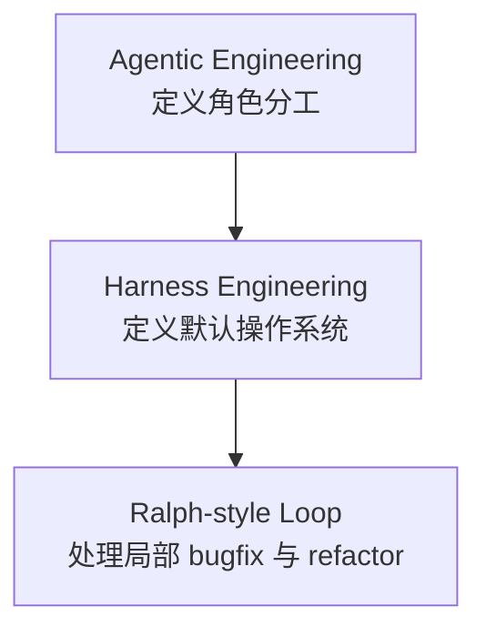

# Harness-First Agentic Development

[English](./README.md) | [简体中文](./README.zh-CN.md)

一套面向 **Agentic Engineering**、**AI Coding Workflow** 和 **Human-in-the-Loop Software Delivery** 的开发方法。

它适合这样的协作关系：

- 人类负责目标、优先级和最终验收，
- AI 负责需求收敛、实现、测试、部署和修复。

---

## 快速介绍

很多 AI 开发流程之所以失效，通常是因为：

1. 产品 Owner 被迫兼任工程师，
2. AI 拿到的自由度太大、约束太少，
3. 从需求到验证再到用户反馈，没有形成明确闭环。

这个仓库要解决的就是这个问题：

> Humans steer. Agents execute. Harnesses control quality.

---

## Quickstart

### 你最少只需要给 AI 3 样东西

1. 这个仓库链接  
   `https://github.com/JNHFlow21/harness-first-agentic-development`

2. 你的项目仓库链接或本地项目路径

3. 一句话产品目标  
   例如：  
   `做一个帮助中文用户准备产品经理面试的 AI 工作台。`

### 直接发给 AI 的 Prompt

```text
请把这个仓库作为我们项目开发的方法规范：
https://github.com/JNHFlow21/harness-first-agentic-development

我的项目仓库 / 目录：
[YOUR_PROJECT_REPO_OR_PATH]

我的产品目标：
[ONE_SENTENCE_PRODUCT_GOAL]

要求：
1. 先读取这个规范仓库。
2. 把它作为本次项目开发的默认方法。
3. 如果我的项目还没有上下文文档，你自己初始化。
4. 先收敛需求，再开始实现。
5. 你负责实现、测试、部署和修复。
6. 在交给我之前，先自己验证。
7. 我只负责目标、优先级和体验验收。
```

### AI 应该自动完成什么

如果 AI 正确使用这套方法，它应该自动做这些事：

1. 先读这个仓库，
2. 再检查你的项目仓库，
3. 如果项目缺文档就自己补齐，
4. 先明确主路径、MVP 和非目标，
5. 再进入实现，
6. 交付前先测试和验证，
7. 最后把可试用版本交给你验收。

也就是说，**人默认不需要手动复制模板**。

---

## 方法结构



### Agentic Engineering

定义分工：

- 人类：目标、优先级、验收
- AI：收敛需求、实现、测试、部署、修复

### Harness Engineering

定义默认开发框架：

- 产品 harness
- 工程 harness
- AI harness
- 质量 harness
- 部署 harness
- 反馈 harness

### Ralph-style Loop

只用于明确且边界清晰的问题：

- 可复现 bug
- 小范围重构
- schema / prompt 兼容问题

---

## 仓库结构

```text
.
├── README.md
├── README.zh-CN.md
├── LICENSE
├── docs/
│   └── harness-first-agentic-development-method.md
└── templates/
    ├── AI_PROJECT_KICKOFF_PROMPT_TEMPLATE.md
    ├── PRODUCT_CONTEXT_TEMPLATE.md
    ├── PROJECT_JOURNEY_TEMPLATE.md
    └── SESSION_HANDOFF_PROMPT_TEMPLATE.md
```

## 入口文档

- [正式方法论文档](./docs/harness-first-agentic-development-method.md)
- [Kickoff Prompt 模板](./templates/AI_PROJECT_KICKOFF_PROMPT_TEMPLATE.md)

模板依然保留，但它们只是：

- 给 AI 初始化项目时参考，
- 给想做更细定制的人使用，

而不是默认的人类第一步。

---

## 适合谁

- 不想自己写代码的产品经理
- 用 AI coding agent 做产品的 founder
- 独立开发者
- 想标准化 AI 开发流程的小团队

---

## 核心原则

- 人类定义目标，AI 负责执行
- 先收敛需求，再写代码
- 先验证，再交付
- 用户反馈高于工程自嗨
- 能自动初始化的事情，尽量交给 AI 自动完成

---

## License

本仓库使用 [MIT License](./LICENSE)。
